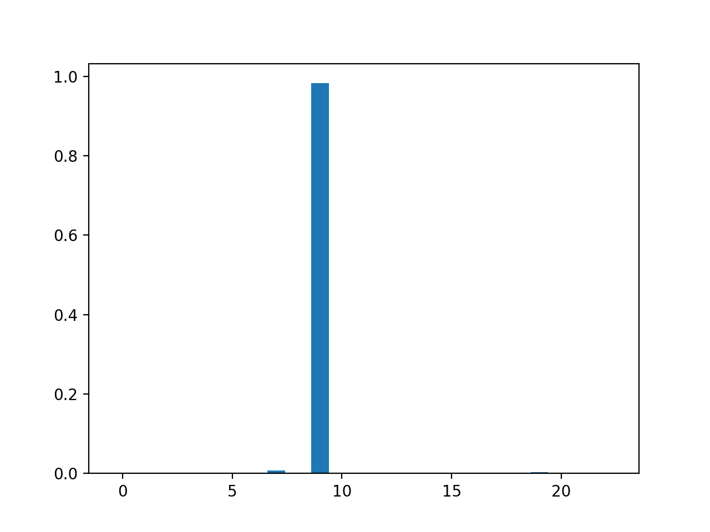
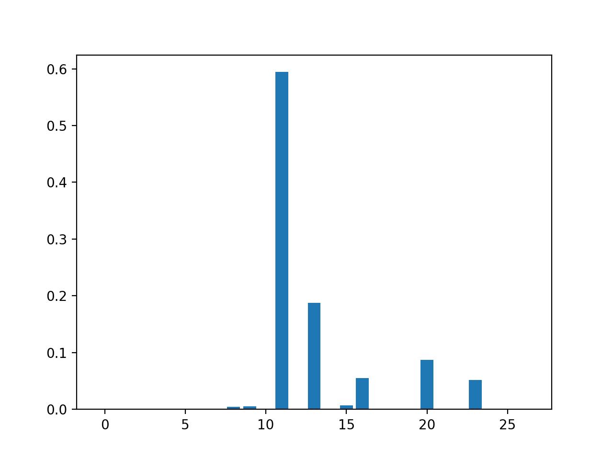
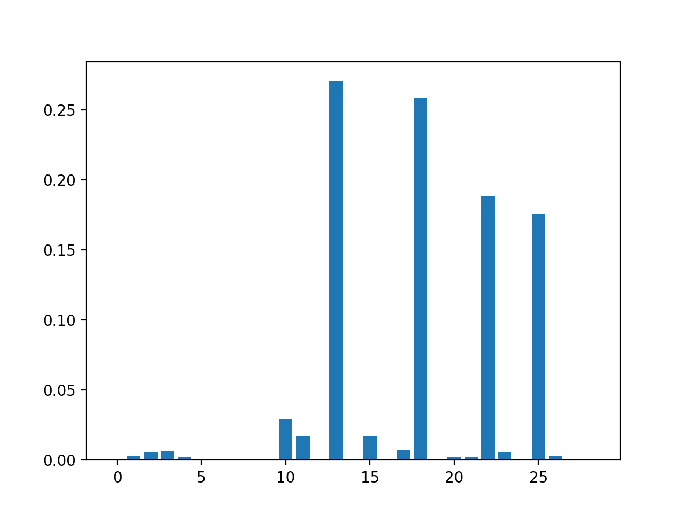

# Aimpathy Coding Task

I have interpreted this task as a slot filling problem. The goal is to transform unstructured data stored in booking notes to structured data, which can then be easily queried.

The structured data is represented as a set of slots:

- CLIENT - Who is the client?
- CONTACT_METHOD - How was the client contacted?
- CONTACT_TIME - When was the client contacted?
- PROJECT_NAME - What project was being discussed?

## Model Selection

I have selected a question-answering model to fill the slots. The model is a BERT model fine-tuned on SQuAD. To fill the slots the model is shown a context and a question. The output of the model are two pointers to the start and the end of the text in the content that answers the question.

For example for the context:

> 21 Jan: Phoned John S about signing them up for phrase 2 of Project Alpha.

We supply the question:

> Who?

And the output points to the 4th word as the start pointer and 5th word as the end pointer:

> John S

## Alternative Models

We could use a Named Entity Recogniser to detect names and places. A Part of Speech tagger could be used to detect numbers and dates. 

For the slots which are filled with a closed class, we can use a regex pattern matcher to detect the values. E.g. CONTACT_METHOD will have a small number of valid values such as "phone", "email", "wrote", etc that could be found with a regex whereas CLIENT is an open class slot that have many valid values.

## Implementation

I've used HuggingFace's Transformer implementation to handle downloading and setting up the question-answering model. 

The slot filler is in fill_slots.py. I've encapsulated the HuggingFace code behind a function which does not include HuggingFace dependencies in the interface. This decoupling gives us the option to swap out the NLP library and model without affecting the rest of the system.

I have selected the Distill BERT model, which can be run on a laptop in seconds. It should be possible to run this model on an AWS Lambda. We could use a larger version of the model for more accuracy, however we would need to host the larger model on a bigger server. HuggingFace also provide a REST interface that could be used to quickly deploy this system.

I've provided a test harness in test_fill_slots.py that fills slots given a context. It also plots the softmax output of the start pointer for diagnosis.

## Model Evaluation

As no test data was supplied, I have created 3 extra synthetic contexts to test the robustness of the question-answering. In addition to the 4 slot questions, I have created a dummy question which does not have an answer in the context. This dummy question tests the failure mode of the models.

The following shows the results of the given test context, and the 3 synthetic contexts:

    Context = 21 Jan: Phoned John S about signing them up for phrase 2 of Project Alpha.
    CLIENT: john s
    CONTACT_METHOD: phoned john s
    CONTACT_TIME: 21 jan
    PROJECT_NAME: project alpha
    DUMMY: phoned john s about signing them up for phrase 2 of project alpha
    Context = 21 Jan: Emailed John S about signing them up for phrase 2 of Project Alpha.
    CLIENT: john s
    CONTACT_METHOD: emailed john s
    CONTACT_TIME: 21 jan
    PROJECT_NAME: project alpha
    DUMMY: signing them up for phrase 2 of project alpha
    Context = Phoned John S yesterday about signing them up for phrase 2 of Project Alpha.
    CLIENT: john s
    CONTACT_METHOD: phoned john s yesterday
    CONTACT_TIME: yesterday
    PROJECT_NAME: project alpha
    DUMMY: phoned john s yesterday about signing them up for phrase 2 of project alpha
    Context = 21 Jan: Talked with John S about the next phase of Project Alpha over the phone.
    CLIENT: john s
    CONTACT_METHOD: over the phone
    CONTACT_TIME: 21 jan
    PROJECT_NAME: project alpha
    DUMMY: project alpha over the phone

Generally the model is robust over 3 of the slots, but struggles with CONTACT METHOD. To further investigate I have plotted the softmax of the start pointer for the CLIENT, CONTACT_METHOD, and DUMMY plots.

### CLIENT start pointer softmax

### CONTACT METHOD start pointer softmax

### DUMMY start pointer softmax

For the CLIENT slot, we see a low entropy distribution with almost all of the probability mass concentrated on one word. The other two plots show much higher entropy, with mass distributed amongst many words. This analysis shows that the model has greater uncertainty when identifying the contact method string.

## Improvements

Fortunately the CONTACT_METHOD slot can be filled effectively with a regex-based method. We can combine the two approaches to make a robust slot filling system.

As the system is used more, we should be able to collate an annotated training set, which would further improve the accuracy of the model.

Recent research has looked at failure modes where answers to questions are not contained in contexts. Applying this research would mean we could detect missing data in the contexts.

